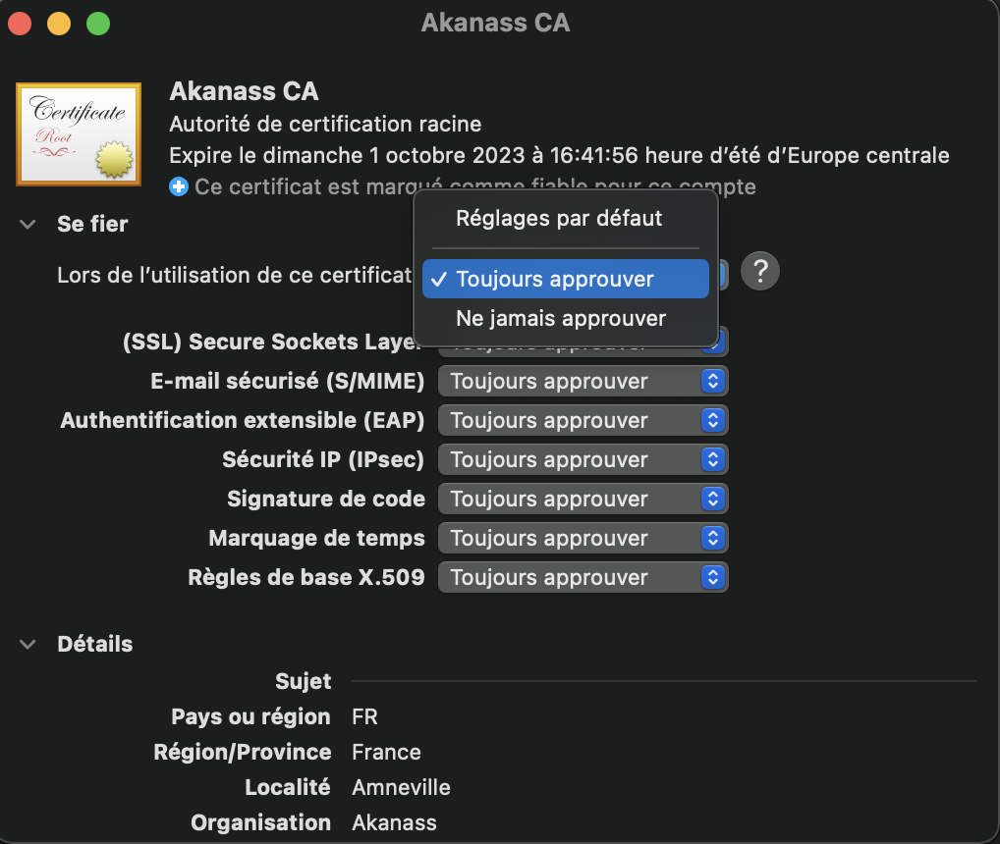
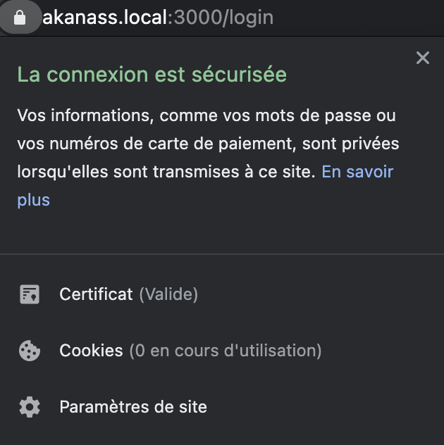
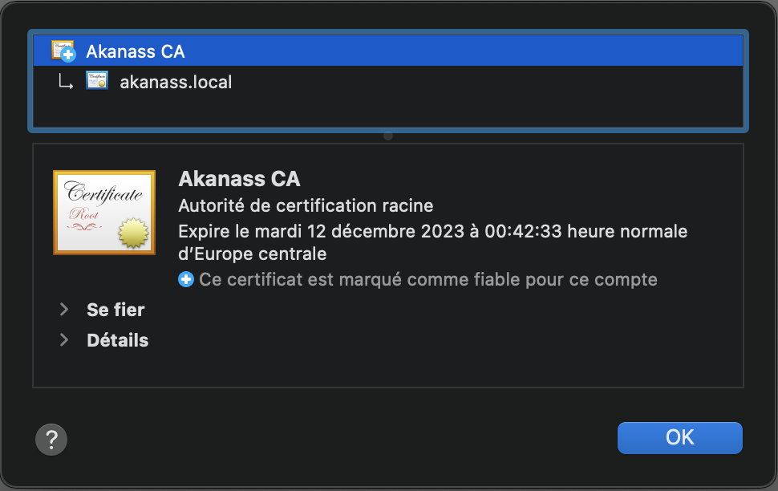
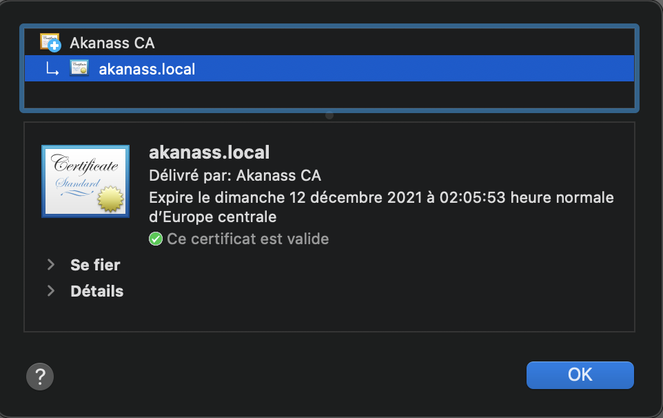

# Self-Signed Certificate with a custom CA

This project has been created to generate a self-signed certificate with a custom CA to be accepted in all browsers during your development phase.

Follow all these steps, and you will have a happy browser with a lock in the address bar.

## Create Root CA (Done once)

Before launching the command, you have to update the `CA config` inside `ssl/cnf/ca.cnf` and change all elements between `{}`:

```
[ req_distinguished_name ]
C   = {FR}
ST  = {ACME STATE}
L   = {ACME CITY}
O   = {ACME}
CN  = {ACME} CA
```
**Attention:** All others elements don't have to be changed.

When it's done, you can generate **rootCA** elements like this:

```bash
$ cd ssl
$ openssl req -config cnf/ca.cnf -x509 -new -days 1095 -out ca/rootCA-crt.pem
```

**Attention:** The `ca/rootCA-key.pem` generated is the key used to sign the certificate requests, anyone holding this can sign certificates on your behalf. So keep it in a safe place!

The root certificate needs to be distributed in all the computers that have to trust us.

### Verify the Root CA's content

```bash
$ cd ssl
$ openssl x509 -in ca/rootCA-crt.pem -text -noout
```

### Trust the Root CA's

Double-click on `ca/rootCA-crt.pem` to insert it on your computer's `Keychain Acces`.

Once the certificate has been inserted into your `Keychain Acces`, you still need to approve it:



## Create a certificate (Done for each server)

This procedure needs to be followed for each server/appliance that needs a trusted certificate from our CA.

Before launching the commands, you have to update the `SSL config` inside `ssl/cnf/ssl.cnf` and change all elements between `{}`:

```
[ req ]
default_keyfile = {acme.domain}-key.pem

[ req_distinguished_name ]
C   = {FR}
ST  = {ACME STATE}
L   = {ACME CITY}
O   = {ACME}
CN  = {acme.domain}

[alt_names]
DNS.1 = {acme.domain}
IP.1 = {192.168.x.x} # your local machine IP
```

**Attention:** All others elements don't have to be changed.

### Create the signing  (csr)

The certificate signing request is where you specify the details for the certificate you want to generate.

```bash
$ cd ssl
$ openssl req -config cnf/ssl.cnf -new -out csr/{acme.domain}-csr.pem
```

### Verify the CSR's content

```bash
$ cd ssl
$ openssl req -in csr/{acme.domain}-csr.pem -noout -text
```

### Generate the certificate using the `acme.domain` csr and key along with the CA Root key and crt

```bash
$ cd ssl
$ openssl x509 -req -in csr/{acme.domain}-csr.pem -CA ca/rootCA-crt.pem -CAkey ca/rootCA-key.pem -CAcreateserial -out {acme.domain}-crt.pem -days 365 -sha512 -extfile cnf/ssl.cnf -extensions v3_req
```

## Verify the certificate's content

```bash
$ cd ssl
$ openssl x509 -in {acme.domain}-crt.pem -text -noout
```

### Generate the PKCS#12 file using the `acme.domain` crt and key along with the CA Root crt

```bash
$ cd ssl
$ openssl pkcs12 -export -out {acme.domain}.p12 -inkey {acme.domain}-key.pem -in {acme.domain}-crt.pem -certfile ca/rootCA-crt.pem
```

## Verify the PKCS#12 file

```bash
$ cd ssl
$ openssl pkcs12 -info -in {acme.domain}.p12
```

## Use your certificate or PKCS#12 file

Now, you can use the `acme.domain` **crt** and **key**, or the **pkcs#12** file inside your application or server.

After, go to `https://acme.domain` in your browser, and you will have a happy browser:






